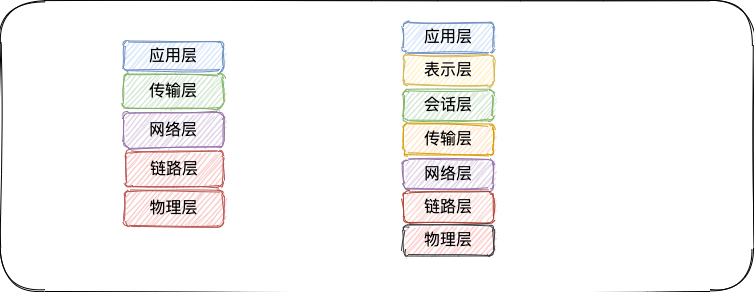
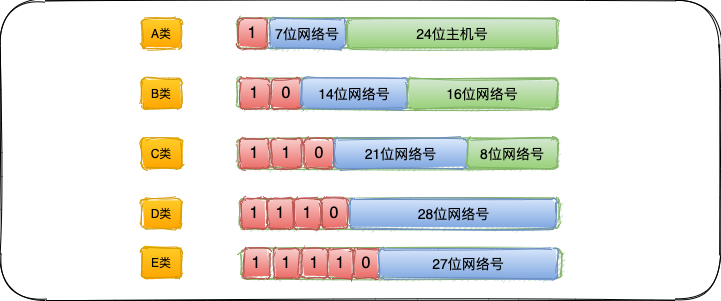

# 计算机网络概述

> 很多不同的厂商生产各种型号的计算机，它们运行完全不同的操作系统，但`tcp/ip`协议族允许它们互相进行通信。这一点很让人感到吃惊，因为它的作用已远远超过起初的设想。`tcp/ip`源于`60`年代末美国资助的一个分组交换网络研究项目，到`90`年代已发展成为计算机之间最常用的组网形式。

## 网络分层（OSI 7层）

网络协议通常分不同层次进行开发，每一层分别负责不同的通信功能。一个协议族，比如`tcp/ip`，是一组不同层次上的多个协议的组合。`tcp/ip`通常被认为是一个五层协议系统：

1）链路层，有时也称作数据链路层或网络接口层，通常包括操作系统中的设备驱动程序和计算机中对应的网络接口。

2）网络层，有时也称为互联网层，处理分组在网络中的活动，例如分组的选路。在`tcp/ip`协议族中，网络层协议包括`IP`协议（网际协议）、`ICMP`（`Internet`互联网控制报文协议）、以及`IGMP`（`Internel`组管理协议）。

3）传输层主要为两台主机的应用程序提供端到端的通信，在`TCP/IP`协议中，有两个互不相同的传输协议：`TCP`（传输控制协议）和`UDP`（用户数据报协议）。`TCP`提供可靠的数据通信，它的工作包括把应用程序交给它的数据分成合适的小块交给下面的网络层，确认接受到的分组，设置发送最后确认分组的超时时钟等。

4）应用层负责处理特定的应用程序细节，几乎各种不同的`TCP/IP`实现都会提供`Telnet`远程登录、`FTP`文件传输协议、`SMTP`简单邮件传输协议、`SNMP`简单网络管理协议。

构建互联网最简单的方法是把两个或多个网络通过路由器进行连接，路由器的好处是为不同类型的物理网络提供连接：以太网、令牌环网、点对点的链接和`FDDI`（光纤分布式数据接口）等等。

## 互联网地址

互联网上的每个接口必须有一个唯一的`Internet`地址，`IP`地址长`32 bit`。`Internet`地址分为`5`类：

这些`32	`位的地址通常写成`4`个`10	`进制的数，其中每个整数对应一个字节。`A`类地址范围`0.0.0.0`~`127.255.255,255`，`B`类地址`128.0.0.0`~`191.255.255.255`，`C`类地址`192.0.0.0`~`223.225.255.255`，`D`类地址`224.0.0.0`~`239.255.255.255`，`E`类地址`240.0.0.0`~`255.255.255.255`。

## 数据链路层

在`TCP/IP`协议族中，链路层主要有三个目的：1）为`IP`模块发送和接收`IP`数据报；2）为`ARP`模块发送`ARP`请求和接收`ARP`应答；3）为`RARP`发送`RARP`请求和接收`ARAP`应答。`TCP/IP`支持多种不同的链路层协议，这取决于网络所使用的硬件，如以太网、令牌环网、`FDDI`（光纤分布式数据接口）及`RS-232`串行线路。

串行线路`IP`的全称是`Serial Line IP`。它是一种在串行线路上对`IP`数据报进行封装的简单形式，在`[Romkey 1988]`中有详细描述。`SLIP`适用于家庭中每台计算机几乎都有的`RS-232`串行端口和高速调制解调器接入`Internet`。

`SLIP`数据帧格式：1）`IP`数据报以一个称为`END`的特殊字符结束。同时，为了防止数据报到来之前的线路噪声被当成数据报内容。大多数实现在数据报的开始处也传一个`END`字符。

2）如果`IP`报文中某个字符为`END`，那么就要连续传输两个字节`0xdb`和`0xdc`来取代它。

环回接口：大多数产品都支持环回接口（`Loopback Interface`），以允许运行在同一台主机上的客户程序和服务器程序通过`TCP/IP`进行通信。`A`类网络号`127`就是为环回接口预留的。根据惯例，大多数系统把`IP`地址`127.0.0.1`分配给这个接口，并命名为`localhost`。

最大传输单元`MTU`，以太网和`802.3`对数据帧的长度都有一个限制，其最大值分别是`1500`和`1492	`字节。链路层的这个特性称作`MTU`，最大传输单元。如果`IP`层有一个数据要传，而且数据的长度比链路层的`MTU`还大，那么`IP`就需要进行分片，把数据报分成若干片，这样每一片都小于`MTU`。

在同一个网络上的两台主机互相进行通信时，该网络的`MTU`是非常重要的。如果两台主机之间的通信要通过多个网络，那么每个网络的链路层就可能有不同的`MTU`，两台通信主机路径中的最小`MTU`被称作路径`MTU`。

