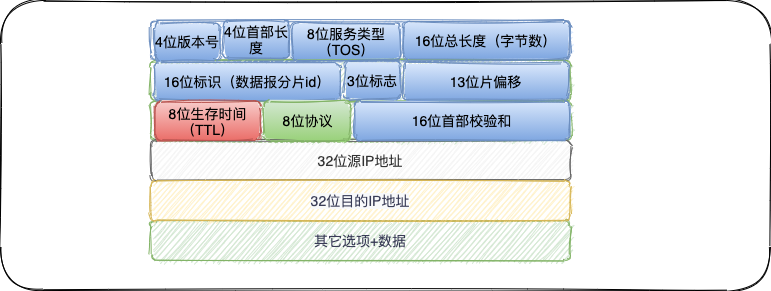

# 计算机网络概述

> 很多不同的厂商生产各种型号的计算机，它们运行完全不同的操作系统，但`tcp/ip`协议族允许它们互相进行通信。这一点很让人感到吃惊，因为它的作用已远远超过起初的设想。`tcp/ip`源于`60`年代末美国资助的一个分组交换网络研究项目，到`90`年代已发展成为计算机之间最常用的组网形式。

## 网络分层（OSI 7层）

网络协议通常分不同层次进行开发，每一层分别负责不同的通信功能。一个协议族，比如`tcp/ip`，是一组不同层次上的多个协议的组合。`tcp/ip`通常被认为是一个五层协议系统：


1）链路层，有时也称作数据链路层或网络接口层，通常包括操作系统中的设备驱动程序和计算机中对应的网络接口。

2）网络层，有时也称为互联网层，处理分组在网络中的活动，例如分组的选路。在`tcp/ip`协议族中，网络层协议包括`IP`协议（网际协议）、`ICMP`（`Internet`互联网控制报文协议）、以及`IGMP`（`Internel`组管理协议）。

3）传输层主要为两台主机的应用程序提供端到端的通信，在`TCP/IP`协议中，有两个互不相同的传输协议：`TCP`（传输控制协议）和`UDP`（用户数据报协议）。`TCP`提供可靠的数据通信，它的工作包括把应用程序交给它的数据分成合适的小块交给下面的网络层，确认接受到的分组，设置发送最后确认分组的超时时钟等。

4）应用层负责处理特定的应用程序细节，几乎各种不同的`TCP/IP`实现都会提供`Telnet`远程登录、`FTP`文件传输协议、`SMTP`简单邮件传输协议、`SNMP`简单网络管理协议。

构建互联网最简单的方法是把两个或多个网络通过路由器进行连接，路由器的好处是为不同类型的物理网络提供连接：以太网、令牌环网、点对点的链接和`FDDI`（光纤分布式数据接口）等等。

## 互联网地址

互联网上的每个接口必须有一个唯一的`Internet`地址，`IP`地址长`32 bit`。`Internet`地址分为`5`类：


这些`32	`位的地址通常写成`4`个`10	`进制的数，其中每个整数对应一个字节。`A`类地址范围`0.0.0.0`-`127.255.255,255`，`B`类地址`128.0.0.0`-`191.255.255.255`，`C`类地址`192.0.0.0`-`223.225.255.255`，`D`类地址`224.0.0.0`-`239.255.255.255`，`E`类地址`240.0.0.0`~`255.255.255.255`。

## 数据链路层

在`TCP/IP`协议族中，链路层主要有三个目的：1）为`IP`模块发送和接收`IP`数据报；2）为`ARP`模块发送`ARP`请求和接收`ARP`应答；3）为`RARP`发送`RARP`请求和接收`ARAP`应答。`TCP/IP`支持多种不同的链路层协议，这取决于网络所使用的硬件，如以太网、令牌环网、`FDDI`（光纤分布式数据接口）及`RS-232`串行线路。

串行线路`IP`的全称是`Serial Line IP`。它是一种在串行线路上对`IP`数据报进行封装的简单形式，在`[Romkey 1988]`中有详细描述。`SLIP`适用于家庭中每台计算机几乎都有的`RS-232`串行端口和高速调制解调器接入`Internet`。

`SLIP`数据帧格式：1）`IP`数据报以一个称为`END`的特殊字符结束。同时，为了防止数据报到来之前的线路噪声被当成数据报内容。大多数实现在数据报的开始处也传一个`END`字符。

2）如果`IP`报文中某个字符为`END`，那么就要连续传输两个字节`0xdb`和`0xdc`来取代它。

环回接口：大多数产品都支持环回接口（`Loopback Interface`），以允许运行在同一台主机上的客户程序和服务器程序通过`TCP/IP`进行通信。`A`类网络号`127`就是为环回接口预留的。根据惯例，大多数系统把`IP`地址`127.0.0.1`分配给这个接口，并命名为`localhost`。

最大传输单元`MTU`，以太网和`802.3`对数据帧的长度都有一个限制，其最大值分别是`1500`和`1492	`字节。链路层的这个特性称作`MTU`，最大传输单元。如果`IP`层有一个数据要传，而且数据的长度比链路层的`MTU`还大，那么`IP`就需要进行分片，把数据报分成若干片，这样每一片都小于`MTU`。

在同一个网络上的两台主机互相进行通信时，该网络的`MTU`是非常重要的。如果两台主机之间的通信要通过多个网络，那么每个网络的链路层就可能有不同的`MTU`，两台通信主机路径中的最小`MTU`被称作路径`MTU`。

## IP：网际协议

`IP`是`TCP/IP`协议族中最为核心的协议，所有的`TCP`、`UDP`、`ICMP`及`IGMP`数据都以`IP`数据报格式传输。许多刚开始接触`TCP/IP`的人对`IP`提供不可靠、无连接的数据报传送服务感到很奇怪，特别是那些具有`X.25`或`SNA`背景知识的人。

不可靠（`unreliable`）的意思是它不能保证`IP`数据报能成功地到达目的地。`IP`仅提供尽力而为的服务。如果发生某种错误时，`IP`有一个简单的错误处理算法：丢弃该数据报，然后发送`ICMP`消息报给信源端。无连接（`connectionless`）这个术语的意思是`IP`并不维护任何关于后续数据报的状态信息，每个数据报的处理是相互独立的。



分析`IP`的首部，最高位在左边，记位`0bit`；最低位在右边，记为`31bit`，这种传输次序称作`big endian`字节序。

目前的协议版本号是`4`，因此`IP`地址有时也称作`IPV4`。

首部长度是指首部占`32 bit`字的数目，包括任何选项。由于它是一个`4`比特的字段，因此首部最长为`60`个字节。

服务类型（`TOS`）字段包括一个`3bit`的优先权子字段，`4 bit`的`TOS`子字段和`1 bit`未用位但必须置`0`。`4 bit`的`TOS`分别代表：最小时延、最大吞吐量、最高可靠性和最小费用。总长度字段是指整个`IP`数据报的长度，以字节为单位。

`TTL（time-to-live）`生存时间字段设置了数据报可以经过的最多路由器数，`TTL`的初始值由源主机设置（通常为`32`或`64	`），一旦经过一个处理它的路由器，它的值就减去`1	`。当`TTL`的值为`0`时，数据报就被丢弃，并发送`ICMP`报文通知源主机。

首部校验和字段是根据`IP`首部计算的检验和码，它不对首部后面的数据进行计算。`ICMP`、`IGMP`、`UDP`和`TCP`在它们各自的首部中均含有同时覆盖首部和数据校验和码（相同的校验和算法）。

`16`位标识，当要发送的数据大于路径`MTU`时，需对`IP`数据报进行分片、数据报标识复制在每个分片中。`13`位片偏移，分片后的数据相对于原始处的位置。

**IP路由选择** ，从概念上说，`IP`路由是简单的，特别对于主机来说。若目的主机与源主机直接相连（如点对点链路）或都在一个共享网络上（以太网或令牌环网）、那么`IP`数据报就直接送到目的主机上；否则，主机把数据报发送一默认（`default`）的路由器上，由路由器转发该数据报。

路由表中的每一项都包含如下：

1）目的`IP`地址，它既可以是一个完整的主机地址，也可以是一个网络地址，由该表目中的标志字段来指定。

2）下一站（或下一跳）路由器的`IP`地址，或者有直接相连的网络`IP`地址。下一站路由是指一个在直接相连网络上的路由器，通过它可以转发数据报。

3）标志，其中一个标志指明目的`IP`地址是网络地址还是主机地址，另一个标志指明下一站路由器是否为真正的下一站路由。

4）为数据报的传输指定一个网络接口。

路由器`gateway`也执行与前面两个路由器相同的步骤，它的默认路由表目所指定的下一站路由器`IP`地址是`140.252.104.2`。每个链路层可能具有不同的数据帧首部，而且链路层的目的地址（如果有的话）始终指的是下一站的链路层地址。数据报每经过一次路由器转发，帧首部都会改变。

**子网寻址**，现在所有的主机都要求支持子网编址（`RFC 950 [Mogul and Postel 1985]` ）。不是把`IP`地址看成由单纯的一个网络号和一个主机号组成，而是把主机号再分成一个子网号和一个主机号。


除了`IP`地址以外，主机还需要知道有多少`bit`用于子网号及几位`bit`用于主机号，这是在引导过程中通过子网掩码来确定的。

`192.168.1.17/24`为`C`类地址，其中划分了`8`位子网号、`8`位主机号。`ip`地址计算方式为`2	`进制的`ip`与`2`进制`netmask`进行`&`计算得到最终结果。

```sh
> ifconfig
inet 192.168.1.17 netmask 0xffffff00 broadcast 192.168.1.255
media: autoselect
status: active
```


## ARP：地址逆解析协议

当一台主机把以太网数据帧发送到位于同一局域网上的另一台主机时，是根据`48 bit`的以太网地址来确定目的接口的。设备驱动程序从不检查`IP`数据报中的目的`IP`地址。

地址解析为这两种不同的地址形式提供映射：`32 bit`的`IP`地址和数据链路层使用的任何类型的地址，`RFC 826[Plummer 1982]`是`ARP`规范描述文档。

在`ARP`背后有一个基本概念，那就是网络接口有一个硬件地址（一个`48 bit`的值，标识不同的以太网或令牌环网络接口）。在硬件层次上进行的数据帧交换必须有正确的接口地址，但是，`TCP/IP`有自己的地址：`32`位置的`IP`地址。知道主机的`IP`地址并不能让内核发送一帧数据给主机。`ARP`的功能是在`32 bit`的`IP`地址和采用不同网络技术的硬件地址之间提供动态映射。

**ARP高速缓存**，`ARP`高效运行的关键是由于每个主机上都有一个`ARP`高速缓存。这个高速缓存存放了最近`Internet`地址到硬件地址之间的映射记录，高速缓存中每一项的生存时间一般为`20`分钟，起始时间从创建时开始。

```
@spotify-mac % arp -a
bogon (192.168.1.2) at 8c:a2:d8:9 on en0 ifscope [ethernet]
? (224.0.0.251) at 1:0fb on en0 ifscope permanent [ethernet]
? (239.255.255.250) at 1:0:5ef:fa on en0 ifscope permanent [ethernet]
```

**ARP的分组格式**，在以太网上解析`IP`地址时，`ARP`请求和应答分组格式如下（`ARP`可以用于其它类型的网络，可以解析`IP`地址以外的地址。需要跟随着帧类型字段的前`4`个字段指定了最后四个字段的类型和长度）。


以太网报头中的前两个字段是以太网的源地址和目的地址，目的地址为全`1`的特殊地址是广播地址。

操作字段指出`4`种操作类型，它们是`ARP`请求（值为`1	`）、`ARP`应答（值为`2	`）、`RARP`请求（值为`3`）和`RARP`应答（值为`4`）。这个字段必需的，因为`ARP`请求和`ARP`应答的帧类型字段值是相同的。

在以太网的数据帧报头中和`ARP`请求数据帧中都有发送端的硬件地址，对于一个`ARP`请求来说，除了目的端硬件地址除外的所有其他的字段都有填充值。当系统收到一份目的端为本机`ARP`请求后，它就把硬件地址填进去，并把操作字段置为`2	`，最后把它送回去。

若`ARP`请求是从一个网络的主机发送另一个网络上的主机，那么连接这两个网络的路由器就可以回答该请求，这个过程称作委托`ARP`或`ARP`代理（`Proxy ARP`）。这样可以欺骗发起`ARP`请求的发送端，使它误认为路由器就是目的主机。路由器的功能相当于目的主机的代理，把分组从其他主机转发给它。


## RARP：逆地址解析协议

网络上的每个系统都具有唯一的硬件地址，它是由网络接口生产厂商配置的。无盘系统的`RARP`实现过程是从接口卡上读取唯一的硬件地址，然后发送一份`RARP`请求（一帧在网络上广播的数据），请求某个主机响应应该无盘系统的`IP`地址（在`RARP`应答中）。

`RARP`分组的格式与`ARP`分组基本一致。它们之间主要的差别是`RARP`请求或应答的帧类型代码为`0x8035`。而且`RARP`请求的操作代码为`3	`，应答操作代码为`4`。

当网络上没有`RARP`服务器时，每个分组的目的地址都是以太网广播地址，在`who-`后面的以太网地址是目的硬件地址，跟在`tell`后面的以太网地址是发送端的硬件地址。更为复杂的是，`RARP`请求是作为一个特殊类型的以太网数据帧来传送的（帧类型为`0x8035`），这说明`RARP`服务器必须能够发送和接收这种类型的以太网数据帧。

`RARP`协议做的事情是：硬件地址 -`convert`-> `IP`地址


## ICMP：Internet控制报文协议

`ICMP`经常被认为是`IP`层的一个组成部分，它传递差错报文及其它需要注意的信息。`ICMP`报文通常被`IP`层或更高层协议`TCP`或者`UDP`使用。一些`ICMP`报文把差错报文返回给用户进程。

当发送一份`ICMP`差错报文时，报文始终包含`IP`的首部和产生`ICMP`差错报文的`IP`数据报的前`8`个字节。这样，接收`ICMP`差错报文的模块就会把它与某个特定的协议（根据`IP`数据报首部中的协议字段来判断）和用户进程联系起来。

`ICMP`地址掩码请求利用无盘系统在引导过程中获取自己的子网掩码，系统广播它的`ICMP`请求报文（这一过程与无盘系统在引导过程中用`RARP`获取`IP`地址是类似的）。

`ICMP`时间戳请求与应答，`ICMP`时间戳请求允许系统向另一个系统查询当前的时间。返回的建议值是自午夜开始计算的毫秒数，协调的统一时间（`Coordinated Universal Time，UTC`）。请求端填写发起时间戳，然后发送报文。应答系统收到请求报文时填写接收时间戳，在发送应答时填写发送时间戳。

`ICMP`端口不可达差错，讨论`ICMP`查询报文-地址掩码和时间戳查询及应答。现在来分析`ICMP`差错报文，即端口不可达报文。它是`ICMP`目的不可达报文中的一种，以此来看`ICMP`差错报文中所附加的信息，使用`UDP`来查看它。

